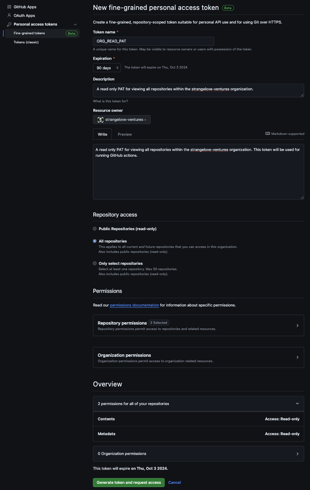

# Private Access Token Configuration

This document outlines how to configure a personal access token (PAT) for use in GitHub Actions workflows. This PAT is used to access private repositories that the project depends upon.

## Create the PAT

1. Log in to your GitHub account.
1. Click on your profile icon in the top right corner and select `Settings`.
1. In the left sidebar, click on `Developer settings`.
1. In the left sidebar, click on `Personal access tokens`.
1. In the dropdown, select `Fine-grained tokens`.
1. Click on `Generate new token`.
1. Name the token. Strangelove uses `ORG_READ_PAT` for organization-wide read access.
1. Set the expiration date to no greater than `90 days`.
1. Write a short description stating the purpose of the token.
1. Select `strangelove-ventures` under `Resource owner`. (Or select the organization that the token will be used for.)
1. Write a quick message to the organization's security team stating the purpose of the token.
1. Select `All repositories` under `Repository access`.
1. Click the `Repository permissions` dropdown, find the `Contents` section, and select `Read-only` for the access level.
1. Ensure the `Overview` section states that the token has read only access to the following items: Contents and Metadata.
1. Click `Generate token and request access` and wait for an organization administrator to approve the token.
1. Once approved, click on the token and copy the value. This value is crucial for the next steps, and it will disappear once the page is refreshed.

Please view the screenshot below for an example of the token's configuration:



## Create the Secret

Now that a PAT has been created and approved, it must be configured as a secret at the repository or organizational level.

### Create a Repository Secret

1. In the repository, click on the `Settings` tab.
1. In the left sidebar, click on `Secrets and variables`.
1. In the dropdown, select `Actions`.
1. Click on `New repository secret`.
1. Provide an intuitive `Name` for the secret.
1. Paste the copied PAT into the `Value` field.
1. Click `Add secret`.

### Create an Organization Secret

1. In the organization, click on the `Settings` tab.
1. In the left sidebar, click on `Secrets and variables`.
1. In the dropdown, select `Actions`.
1. Click on `New organization secret`.
1. Provide an intuitive `Name` for the secret. Strangelove uses `ORG_READ_PAT` for its organization-wide read access token.
1. Paste the copied PAT into the `Value` field.
1. From the `Repository access` dropdown, ensure all necessary repositories have access to the secret. Strangelove uses all public and private repositories.
1. Click `Add secret`.

## Configure the Github Actions Workflow

The PAT secret can now be used in GitHub Actions workflows. As viewed in the [build-and-test.yml](../.github/workflows/build-and-test.yml) workflow, the `READ_PAT` environment variable is set to the secret's value. This environment variable is then used to configure the git config to allow the workflow to access private repositories.

Below are the two code snippets pulled from that workflow which configure the PAT secret in a build job:

```yaml
env:
  READ_PAT: ${{ secrets.ORG_READ_PAT }}
```

```yaml
- name: Configure git to use PAT for reading private repositories
  run: git config --global url."https://${{ env.READ_PAT }}:x-oauth-basic@github.com/".insteadOf "https://github.com/"
```